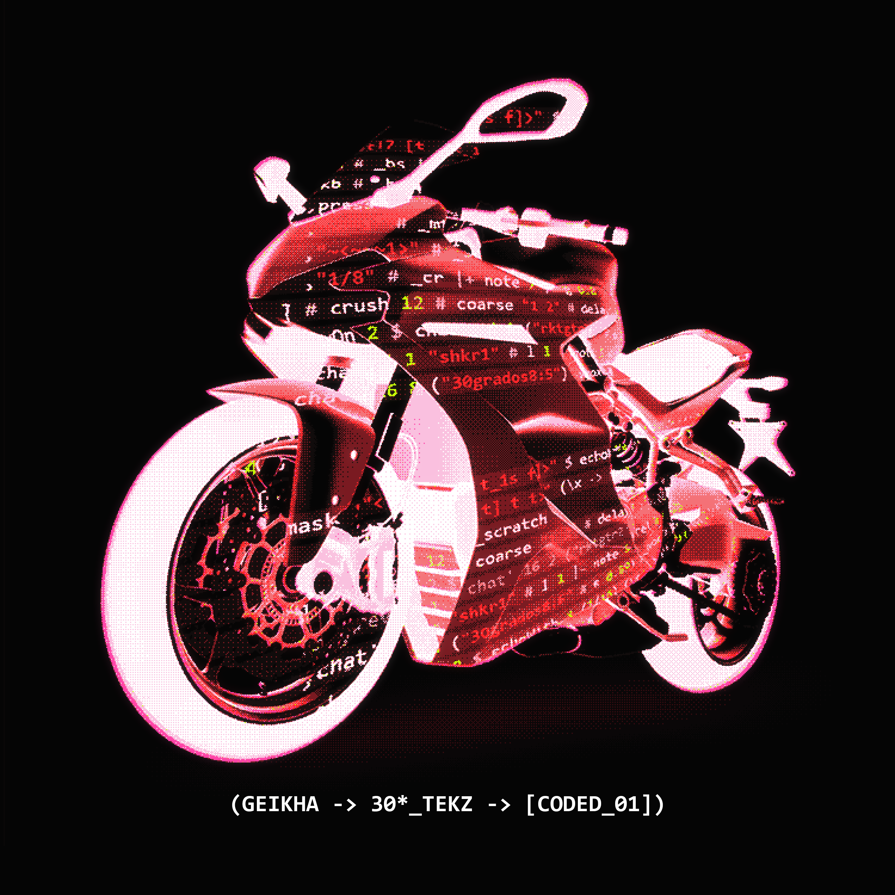
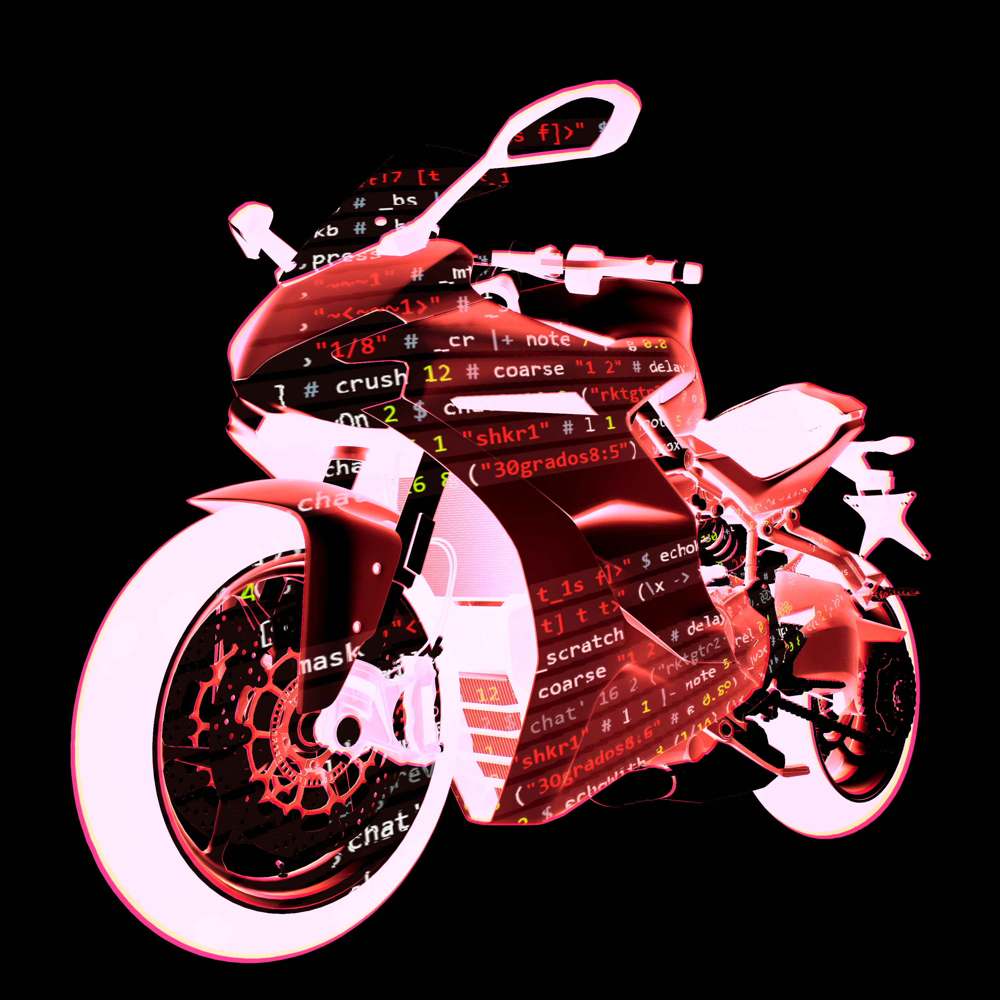
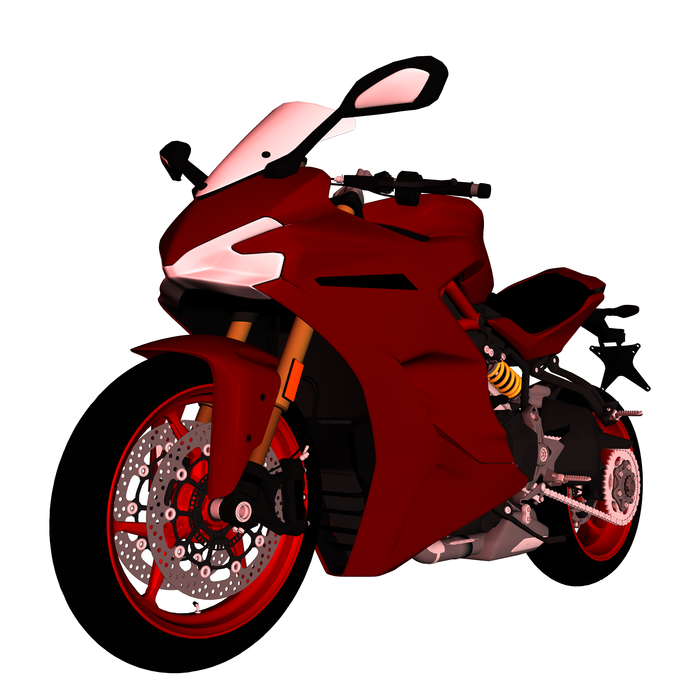

# 30*_TEKZ_ART

Artwork for the single release:

## The Sports Bike

The composite of the bike was using [Hydra Video Synth](https://github.com/hydra-synth/hydra).

### 3D Model

The [3D model of the bike](https://skfb.ly/oHORO) used here was created by **appsnation** and is licensed under [Creative Commons Attribution](http://creativecommons.org/licenses/by/4.0/).
